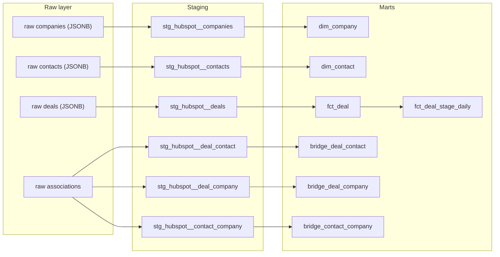

# Design notes

This is the reasoning behind the pipeline's shape — grain, watermarking, and the
HubSpot API quirks that shaped it — pulled out of the [README](../README.md) into
one place, alongside the dbt dependency graph.

## dbt DAG

Bridge tables are one hop from their raw association source, not from the fact
table — a link between a deal and a contact is a fact about the relationship, not a
derived property of either dimension. `fct_deal_stage_daily` builds on `fct_deal`
rather than on staging directly, so a stage-history rule only has to be correct once.

## Grain and dimension type

The fact table grain is one row per HubSpot deal because a deal is the unit whose
value and stage the commercial team measures. Associations are separate bridge tables
because forcing multiple contacts or companies into one foreign key silently loses
information. Contact and company are current-state (Type 1) dimensions: changed
emails or names overwrite the prior value. If historical attributes mattered — for
example, attributing pipeline to the company segment at the time of creation — the
right fix is effective dates and current-row flags as Type 2 dimensions, not a
workaround at the mart layer.

## Watermarking

The extractor uses a conservative high-watermark: each object's watermark is the run
start time, written only after its upserts commit, and every run re-reads a five
minute overlap before it. Records changed during a run, and records whose changes had
not yet reached the search index when the run started, are therefore eligible again
next time. Primary-key upserts make that overlap free — re-processing an unchanged
row is a no-op, not a duplicate.

At higher volume, the next change is streaming pages into batched inserts rather than
holding one object page's results in memory before writing.

## Two API details that cost more than the rest of the extractor combined

**Modification timestamp field names are not consistent across object types.**
Contacts answer to `lastmodifieddate`; companies and deals answer to
`hs_lastmodifieddate`. Filtering contacts on the wrong field does not raise an error —
it returns zero results, so an incremental run would have quietly stopped seeing
contact changes after the first load. `stg_hubspot__contacts` carries a `not_null`
test on `modified_at_utc` specifically so that class of mistake becomes a failing
build instead of a silent gap.

**The search endpoint refuses to page past 10,000 results.** Incremental queries sort
ascending by modification time and re-anchor on the last record seen, rather than
paging with an offset that would eventually hit the cap.

Associations are read through the v4 batch endpoint (100 objects per call) instead of
one call per object per association type. Objects that come back with no associations
still matter: their rows are deleted before insert, because a link removed in HubSpot
has no row to update and would otherwise survive forever in the bridge table.

## What this version does not do

Schema-drift detection, source object deletions, association history, and true
deal-stage snapshots are all out of scope for this version.
`fct_deal_stage_daily` groups current deals by creation date and current stage;
reconstructing stage-as-of-day would require HubSpot property history, which this
pipeline does not extract. It also runs on single-node PostgreSQL rather than
AWS-managed storage and compute. At Famly scale, the next steps would be landing
immutable batches in S3, orchestrating with a managed scheduler, adding explicit data
contracts and freshness alerts, and publishing marts through atomic swaps.

## Reviewer note on `scripts/seed_demo.py`

Seeding a live HubSpot test portal needs
`crm.objects.{contacts,companies,deals}.write` on the private app — a scope the
pipeline itself never uses. The intended flow is: add the scope, run
`scripts/seed_demo.py`, then remove the scope again. `scripts/load_fixture.py` is the
reviewer path that needs no token and no live portal at all; reach for
`seed_demo.py` only when validating against a real HubSpot account end to end.
